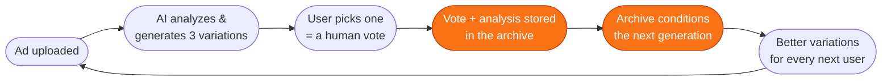

# AdMultiply — Backend Architecture & The Self-Improving AI Loop

*How the system works, what it learns from every video, and why it compounds into a defensible advantage.*

---

## 1. Executive summary

AdMultiply's backend is a **video intelligence pipeline wrapped around a data flywheel**.

The pipeline does one job extremely well: take one winning 1-minute+ video ad, understand *why* it works, and generate three high-converting micro variations in seconds — fully automated, no editing.

But the architecture's real design goal is the second layer: **every video processed teaches the system.** Each upload adds to a proprietary dataset of winning-ad structures — what hooks work, in which categories, validated by real user choices. The AI's output quality scales with the size of that archive. Competitors can copy the features in months; they cannot copy the accumulated dataset, and the gap widens with every upload.

One pipeline. Two products: the video tool the customer sees, and the learning engine underneath it.

---

## 2. System architecture

```
                        ┌────────────────────────────┐
                        │   NEXT.JS WEB APP (Vercel) │
                        │  upload · preview · billing │
                        └─────────────┬──────────────┘
                                      │ REST + presigned upload URLs
                        ┌─────────────▼──────────────┐
                        │     FASTAPI BACKEND         │
                        │ auth · jobs · webhooks ·    │
                        │ token ledger · rate limits  │
                        └───┬──────────────────┬─────┘
                   enqueue  │                  │  read / write
              ┌─────────────▼───────┐   ┌──────▼──────────────────┐
              │   REDIS + CELERY    │   │   SUPABASE POSTGRES     │
              │  analyze queue (I/O)│   │  users · videos · jobs  │
              │  render queue (CPU) │   │  variations · tokens ·  │
              └─────────────┬───────┘   │  events · ai_metadata   │
                            │           │  + pgvector embeddings  │
                            │           └──────▲──────────────────┘
              ┌─────────────▼───────────────┐  │ every step writes back
              │      AI PIPELINE (async)     │──┘
              │  TwelveLabs → Whisper →      │
              │  GPT-4o Mini → FFmpeg        │
              └─────────────┬───────────────┘
                            │ store clips
              ┌─────────────▼───────────────┐
              │  CLOUDFLARE R2 object store  │→ watermarked previews
              │  (zero-egress delivery)      │→ HD downloads (paid)
              └─────────────────────────────┘

   ANALYTICS LAYER (reads from everything, powers decisions + investor metrics)
   ┌──────────────┐  ┌──────────────┐  ┌──────────────┐
   │   PostHog    │  │   Metabase   │  │    Stripe    │
   │ behaviour /  │  │ BI dashboards│  │ MRR · churn ·│
   │ funnels      │  │ on Postgres  │  │ LTV          │
   └──────────────┘  └──────────────┘  └──────────────┘
```

**Component roles, one line each:**

| Component | Role |
|---|---|
| **FastAPI** (Python) | The brain's front door — auth, job orchestration, billing webhooks, token ledger |
| **Celery + Redis** | Async job engine; two queues so a heavy render never blocks an upload |
| **Supabase Postgres** | Single source of truth — every user, video, job, choice, and embedding |
| **TwelveLabs** | Video understanding — scenes, hooks, product moments, emotional beats |
| **Whisper** | Word-level timestamped transcription — enables cutting on speech boundaries |
| **GPT-4o Mini** | Creative reasoning — turns analysis into 3 distinct variation strategies |
| **FFmpeg** | Deterministic rendering — executes each strategy into a finished 9:16 clip |
| **Cloudflare R2** | Video storage + delivery with zero egress fees |
| **PostHog / Metabase / Stripe** | Behaviour, BI, and revenue analytics — the investor dashboard |

---

## 3. The pipeline — from one ad to three, step by step

```
 UPLOAD          ANALYZE                 PLAN                RENDER           DELIVER
┌───────┐   ┌───────────────┐   ┌──────────────────┐   ┌─────────────┐   ┌──────────┐
│ 90s   │──▶│ TwelveLabs:   │──▶│ GPT-4o Mini      │──▶│ FFmpeg cuts │──▶│ 3 clips: │
│ video │   │ scenes, hooks │   │ writes 3 distinct│   │ each EDL    │   │ preview  │
│ direct│   │ Whisper:      │   │ strategies as    │   │ into a 9:16 │   │ (free) or│
│ to R2 │   │ word-level    │   │ EDLs (edit       │   │ clip with   │   │ HD (paid)│
└───────┘   │ transcript    │   │ decision lists)  │   │ captions    │   └──────────┘
            └───────────────┘   └──────────────────┘   └─────────────┘
                    │                    │                    │
                    ▼                    ▼                    ▼
            ═══════════════ EVERYTHING IS WRITTEN TO POSTGRES ═══════════════
```

1. **Upload** — browser uploads directly to R2 via a presigned URL (a 100MB file never touches our API). A job is created; a token is reserved.
2. **Analyze** — TwelveLabs indexes the video once (scenes, hooks, product moments); Whisper produces a word-level timestamped transcript. Combined, the system knows *what happens, when, and what's said* — down to the word.
3. **Plan** — GPT-4o Mini receives the full analysis and returns **three distinct strategies** (e.g. hook-first, problem–solution, social-proof-led) as structured **EDLs**: exact cut points, ordering, caption text, hook overlay. The EDL is the contract between the AI and the renderer — auditable, reproducible, re-renderable.
4. **Render** — FFmpeg executes each EDL: cuts on word boundaries, reframes to 9:16, burns animated captions, watermarks free-tier output.
5. **Deliver** — three watermarked previews appear in the browser; HD downloads unlock with a paid plan. Failed jobs auto-retry per-step and refund the token if unrecoverable.

Typical wall-clock: **~60–90 seconds** from upload to three previews.

---

## 4. The data capture layer — what every video teaches us

The pipeline is instrumented so that **every upload deposits a complete training example** into Postgres. Per video, we permanently store:

| What we capture | Why it matters |
|---|---|
| **Full video analysis** (scenes, hooks, moments, pacing) | The structural DNA of an ad that already converts |
| **Auto-detected category** (fitness, skincare, SaaS…) | Lets learning become category-specific |
| **Word-level transcript** | The language of winning ads — hooks, claims, CTAs |
| **The 3 generated strategies (EDLs)** | What the AI proposed, in full detail |
| **Which variation the user downloaded** | **A human vote.** The user just labeled our data for free |
| **Regenerations & abandons** | Negative signal — what the AI got wrong |
| **Embedding vector** (pgvector, in-database) | Makes every past ad instantly searchable by similarity |

The critical design rule: **data not logged on day one is gone forever.** This layer ships with the MVP — the dashboards can evolve later, the capture cannot.

Every user interaction is simultaneously product usage *and* dataset growth. A user who uploads one video and downloads one variation has — without knowing it — told the system which of three creative strategies wins for their category.

---

## 5. The learning loop — how the AI gets better on its own



The loop activates in four stages, each unlocked by the data the previous one accumulates — and each built on managed services (no ML team required to operate it):

### Stage 1 — Retrieval: the archive joins the pipeline
When a new ad arrives, the system embeds it and searches the archive (pgvector) for the **most similar high-performing ads in the same category** — ads whose variations users actually chose. Their winning patterns are injected into the generation prompt as live context.

> *"Here are 5 fitness ads similar to this one, and the hook structures users picked. Generate in that direction."*

From this moment, **output quality scales with archive size** — more users literally means a better product. This is the flywheel's ignition point.

### Stage 2 — Self-optimizing strategies
The system continuously measures **win-rates per strategy per category**: if "hook-first" gets downloaded 61% of the time in fitness but "social-proof-led" dominates skincare, the strategy mix shifts automatically per category. The AI tunes its own creative playbook from user behaviour — no manual re-engineering.

### Stage 3 — A model that speaks AdMultiply
Once the archive holds ~1,000 curated *analysis → winning variation* pairs, we fine-tune GPT-4o Mini on them (OpenAI's managed fine-tuning). The result is a model with AdMultiply's accumulated creative judgment baked in — better output, lower per-call cost, and **unreproducible without our dataset**.

### Stage 4 — Market-validated learning
The ad-manager integration (Meta / Google) upgrades our labels from *"the user picked it"* to *"the market converted on it"* — real CTR and ROAS flowing back per variation. The system stops learning what people *choose* and starts learning what actually *sells*, per category. This is where the loop compounds hardest.

### Why this ends in defensibility

Every stage deepens the same asset: **a proprietary, growing dataset of winning-ad structures, labeled first by human choices and eventually by market performance.** Features can be cloned in a quarter. The dataset cannot — a competitor starting later must acquire users at scale with a worse product to even begin collecting it, while ours improves with every upload. The moat isn't the AI. It's what the AI has seen.
