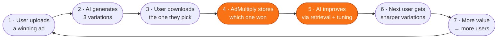

# AdMultiply — The Data Flywheel

> **The thesis in one line:** Every ad uploaded teaches AdMultiply what converts. Competitors can copy our features. They can't copy our archive.

---

## The cycle



*(Mermaid renders in GitHub, Notion, VS Code, and most markdown previewers. Screenshot for slide decks.)*

---

## ASCII fallback (for PowerPoint / Google Slides)

```
        ┌─────────────────────────────────┐
        │  1. USER UPLOADS A WINNING AD   │
        └────────────────┬────────────────┘
                         │
        ┌────────────────▼────────────────┐
   ┌───▶│  2. AI GENERATES 3 VARIATIONS   │
   │    └────────────────┬────────────────┘
   │                     │
   │    ┌────────────────▼────────────────┐
   │    │  3. USER PICKS + DOWNLOADS ONE  │
   │    └────────────────┬────────────────┘
   │                     │
   │    ┌────────────────▼────────────────┐   ◀── THE MAGIC STEP
   │    │  4. WE STORE WHICH ONE WON      │
   │    └────────────────┬────────────────┘
   │                     │
   │    ┌────────────────▼────────────────┐   ◀── THE MAGIC STEP
   │    │  5. AI MODEL IMPROVES (RAG/FT)  │
   │    └────────────────┬────────────────┘
   │                     │
   │    ┌────────────────▼────────────────┐
   │    │  6. NEXT USER → BETTER OUTPUTS  │
   │    └────────────────┬────────────────┘
   │                     │
   │    ┌────────────────▼────────────────┐
   └────│  7. MORE VALUE → MORE USERS     │
        └─────────────────────────────────┘
```

---

## How each step works

| # | Step | What happens technically |
|---|------|--------------------------|
| 1 | **Upload winning ad** | User drops a 30–90s video they know already converts |
| 2 | **AI generates variations** | TwelveLabs identifies hooks/scenes → GPT-4o Mini writes new copy → FFmpeg assembles 3 micro-ads |
| 3 | **User picks + downloads** | They preview all 3, spend a token to download the best one |
| 4 | **We store which won** | The "downloaded" variation is the user's vote. We log this against the original ad's features |
| 5 | **AI improves** | RAG retrieves similar high-performing ads as context for future generations; over time we fine-tune our own model on the dataset |
| 6 | **Next user → better outputs** | New uploads benefit from every prior user's signal |
| 7 | **More value → more users** | Better outputs = retention + word-of-mouth + lower CAC |

---

## Why this is defensible

- **Competitors can copy the features in months.** They can't copy our dataset.
- **The dataset compounds.** Each new user makes it better for every future user.
- **The cost to a competitor catching up grows.** They need to acquire their own users to generate their own dataset — which means out-marketing us with a worse product.
- **Same flywheel powers TikTok, YouTube, Netflix.** Proven pattern, just applied to ad creative.

---

## What the investor should hear

> "We're not betting that nobody can build AdMultiply's features. We're betting that nobody can build them *and* accumulate the dataset we will have. Funding buys us the time to lap the field on data — and the data is the product."
